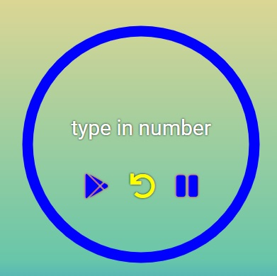

# CounterApp

## Demo

[**click live demo of the project**](https://dominiksiejka.github.io/CounterApp)



## Table of Contents

- [About the Project](#description)
- [How to use](#how-to-use)
- [Technologies used](#built-with)
- [Setup steps](#setup)
- [Sources](#sources)
- [License](#license)

## Description

Simple Counter App, which shows the time you got left, for example to finish your body exercise. It also contains a nice animation according to the reamining time. The circle was made with svg and shows the circle dash-array according to the time you got left. There are 3 buttons play, restart and pouse.

## How to use

As mentioned before. The App has three buttons. Play, Reset and Pouse.
First of all enter the number of seconds you wanna to start with your counter, in the place where it says 'type in number'. Then press play button. The counter will start as well as the circle animation. To Reset the input value to 0.00, simply press Reset button. After that the circle will return to the base position. When you just want to stop the timer for a few seconds or make a break, simply press Pouse button. The timer will stop and after pressing play again it will count from the place you have stopped it.

## Built with

- HTML5
- CSS
- Vanilla JavaScript

## Setup

```
with BASH

# clone the remote repo to your local one
$ git clone https://github.com/dominiksiejka/CounterApp.git

# open the index.html file or use your code editor to open it with live server

```

## Sources

- Icons from [Font Awesome ](https://fontawesome.com)
- Font from [Google Fonts ](https://fonts.google.com/)

## License

- MIT © [Dominik Siejka ](https://github.com/dominiksiejka/CounterApp)
